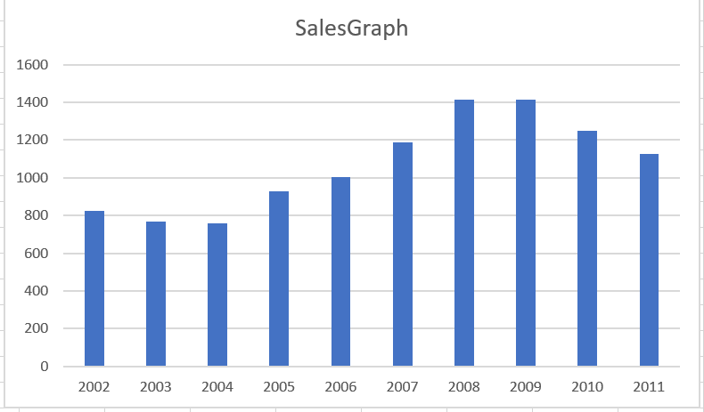

# map-reduce-Jagarlamudi
Practicing map-reduce

## About Data:
This dataset contains a list of video games with sales greater than 100,000 copies. This dataset has 11 attributes namely Rank,Name,Platform,Year,Genre,Publisher,NA_Sales,EU_Sales,JP_Sales,Other_Sales,Global_Sales.

## Question:
Which vedio game has highest sales based on year?

## Data Story:
This data shows the year sales of the vedio game to analyze the data for more than 160k sales. Below it shows a bar garph based on sales.

